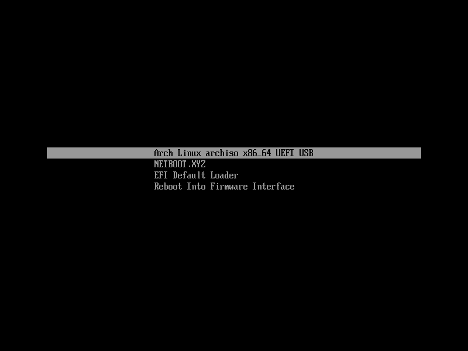

# Custom Arch Linux Image

Archiso with GNOME desktop and personal tweaks.

## Extras

+ A systemd-boot entry is provided for booting [Netboot.xyz](https://netboot.xyz/)

+ Dark themes by default everywhere

+ `arch-wiki-docs` and `arch-wiki-lite` are installed. Firefox homepage is set to the local Installation Guide page.

+ Personal tweaks to Firefox

+ uBlock Origin installed

+ Fish is the default shell

+ Personal tweaks to GNOME and GNOME apps

+ Fractiona Scaling enabled by default

+ [Starship](https://starship.rs/) prompt installed

+ [inxi](https://github.com/smxi/inxi) installed

+ [Dracula](https://draculatheme.com/) theme applied

+ Extra apps like: GNOME Disk Utility, Evince, GParted, GNOME Screenshot, Gedit, and GNOME System Monitor

## Screenshots

## Building

`make build`

This will output a `img` instead of an `iso`. This can be written to a USB in the same
way, but will only boot on UEFI systems.

## Create Boot USB with Data Partition

If you have a large USB drive, it wouldn't make sense to lose that space to this small image.

+ Format the USB as GPT.
+ Create 2GiB FAT32 partition
+ Create a second partition that uses the rest of the space.
    - Use whatever filesystem depending on your use case. Maybe NTFS or exFat if you need to be able to access this partition on a Windows system.
+ Mount the image file from the build process and copy the files to the first parition